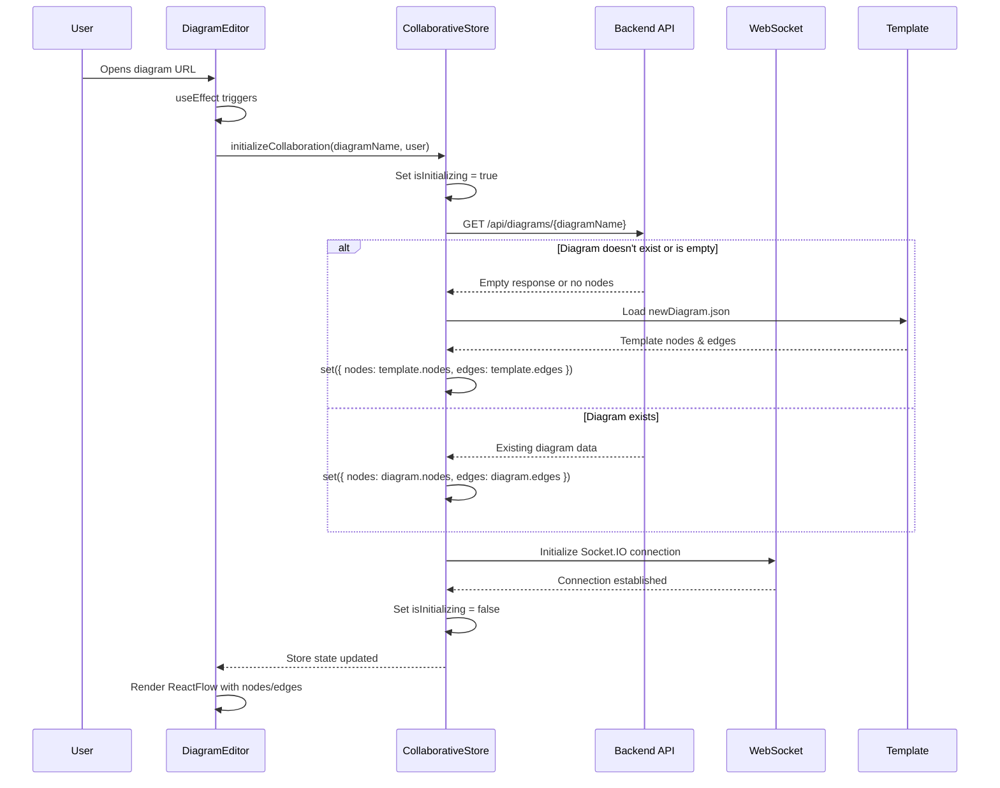
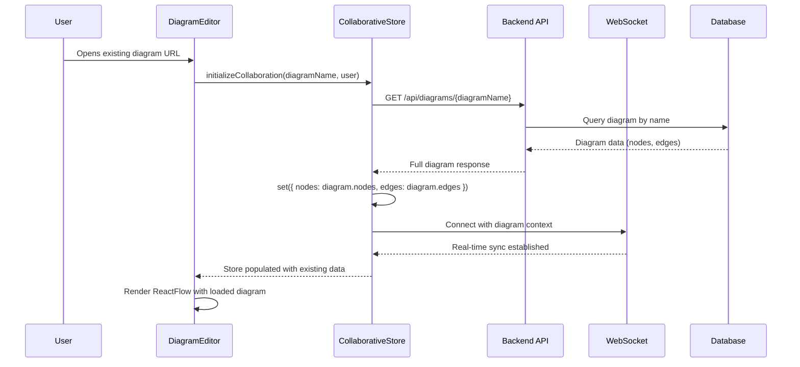
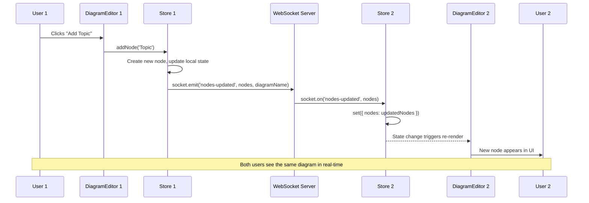
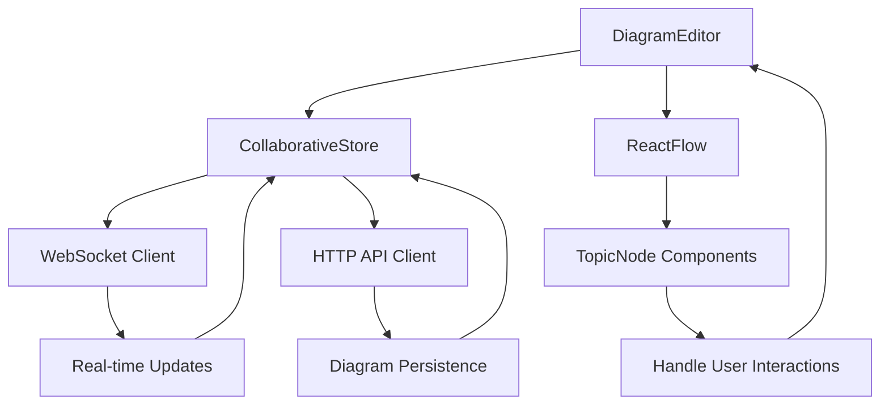
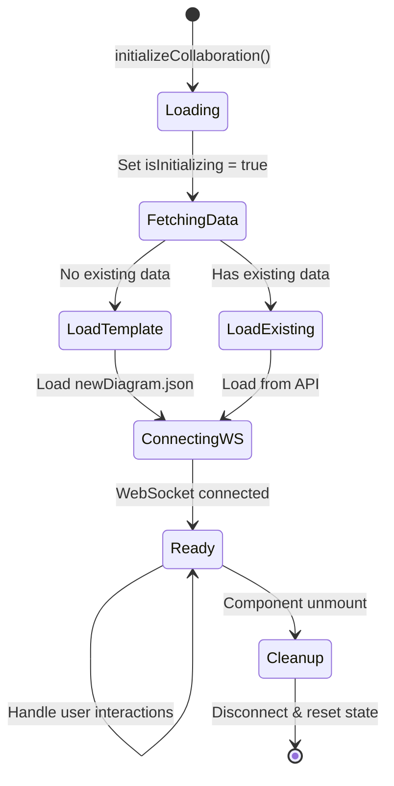
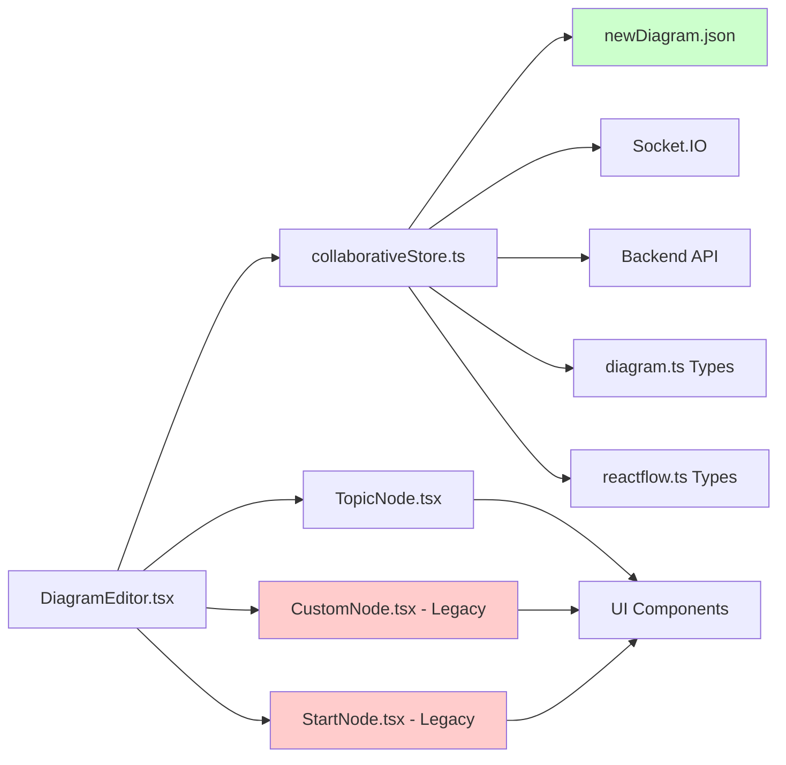
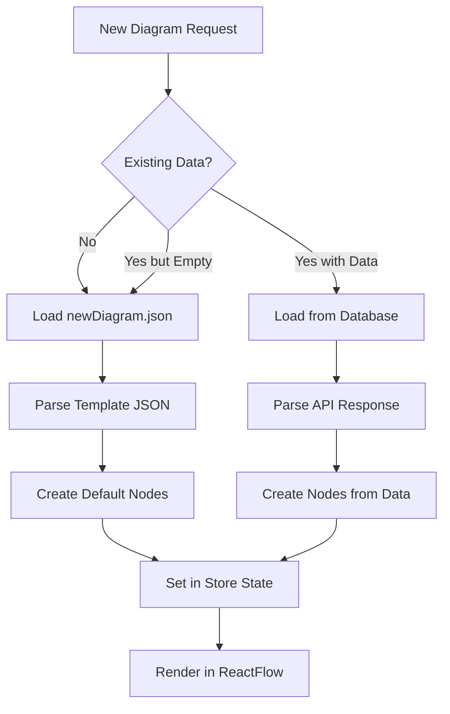

# Data Flow Diagrams

## 1. New Diagram Creation Flow



## 2. Existing Diagram Loading Flow



## 3. Real-time Collaboration Flow



## 4. Node Creation Detailed Flow

```mermaid
flowchart TD
    A[User clicks Add Topic] --> B[DiagramEditor.addNode('Topic')]
    B --> C[CollaborativeStore.addNode]
    C --> D[Generate unique ID with timestamp]
    D --> E[Calculate auto-position based on existing nodes]
    E --> F[Create DiagramNode object]
    F --> G[Add to local nodes array]
    G --> H{WebSocket connected?}
    H -->|Yes| I[Broadcast to other users]
    H -->|No| J[Store locally only]
    I --> K[Other users receive update]
    J --> L[ReactFlow re-renders with new node]
    K --> L
```

## 5. Component Interaction Flow



## 6. Store State Management



## 7. File Dependencies



## 8. Template System Flow



---

These diagrams show the complete data flow for both new and existing diagram scenarios, helping team members understand how data moves through the system and where to look when debugging issues.