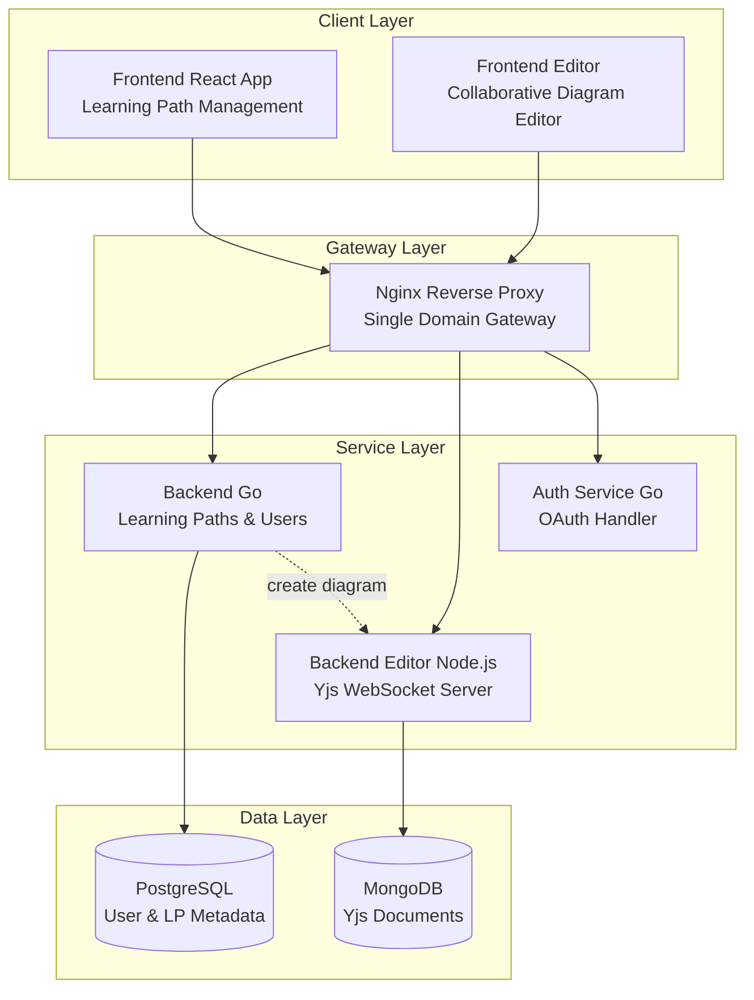
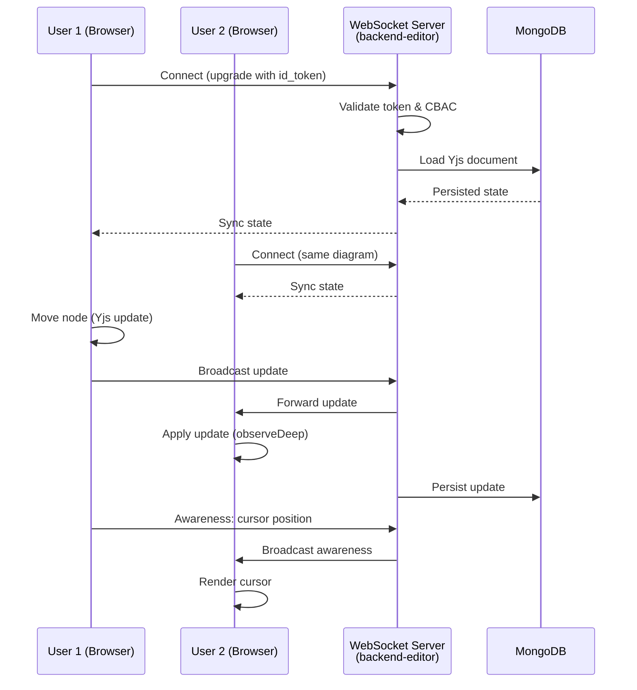
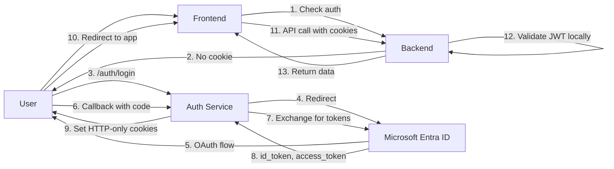
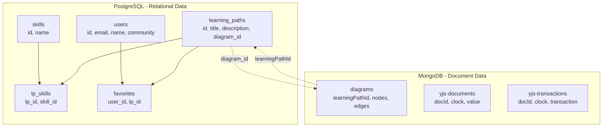
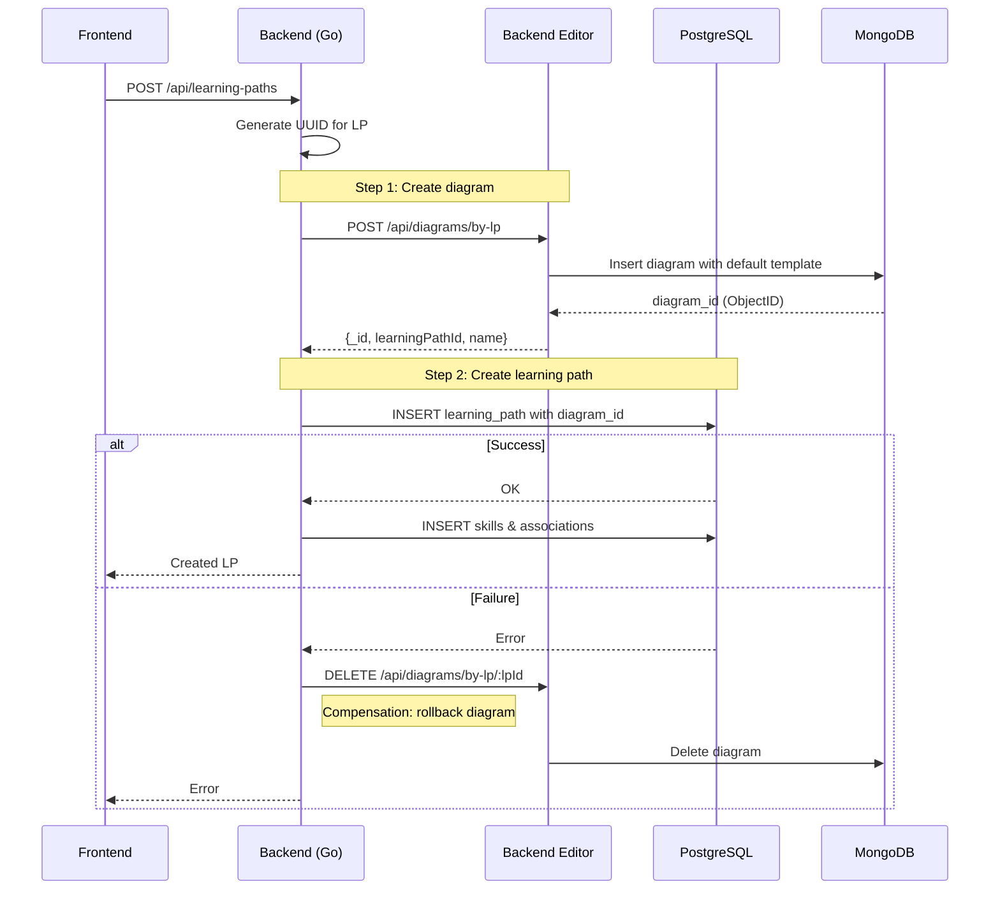
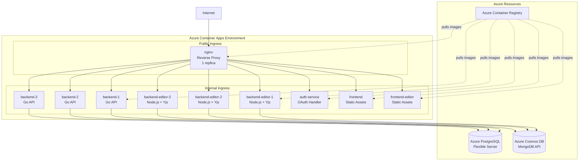

# Rosetta - Learning Path Management Platform

**Architecture Documentation**
**Version:** 2.0
**Last Updated:** January 2026
**Status:** Production

---

## Table of Contents

1. [System Overview](#system-overview)
2. [Architecture Components](#architecture-components)
3. [Technology Stack](#technology-stack)
4. [Real-Time Collaboration](#real-time-collaboration)
5. [Authentication & Authorization](#authentication--authorization)
6. [Data Architecture](#data-architecture)
7. [State Management](#state-management)
8. [Deployment Architecture](#deployment-architecture)
9. [API Specifications](#api-specifications)
10. [Architectural Decisions](#architectural-decisions)
11. [Performance & Scaling](#performance--scaling)

---

## System Overview

Rosetta is a collaborative learning path management platform that enables users to create, edit, and share visual learning roadmaps in real-time. The platform uses a **microservices architecture** with specialized services for different concerns.

### High-Level Architecture



### Core Features

- **Real-time Collaborative Editing**: Multiple users edit diagrams simultaneously using CRDT-based synchronization
- **Visual Diagram Editor**: Interactive node-based editor built with ReactFlow
- **OAuth Authentication**: Microsoft Entra ID (Azure AD) integration
- **Community-Based Access Control (CBAC)**: Document-level permissions based on user communities
- **Learning Path Management**: Full CRUD operations for learning paths
- **Skill Tagging**: Associate skills with learning paths

---

## Architecture Components

### 2.1 Frontend (Main Application)

**Location:** `/apps/frontend`
**Purpose:** Primary user interface for browsing and managing learning paths

**Technology Stack:**
- React 19.0.0 + Vite
- React Router DOM 7.x for routing
- Zustand 5.x for state management
- TailwindCSS 4.x for styling
- Radix UI for accessible components

**Key Features:**
- Learning path browsing
- Bookmarks management
- Community Hub to discover and create Learing Paths
- User profile management

**State Management:**
- `userStore.ts` - User profile and authentication state
- `learningPathStore.ts` - Learning paths and Bookmarks

**Routes:**
```
/                    → Landing page
/dashboard           → Learning paths overview
/creator-studio      → Create new learning path
/profile             → User profile
/learning-paths/:id  → Learning path details
```

### 2.2 Frontend Editor (Collaborative Editor)

**Location:** `/apps/frontend-editor`
**Purpose:** Real-time collaborative diagram editor for learning paths

**Technology Stack:**
- React 19.1.0 + Vite
- ReactFlow (@xyflow/react 12.7.1) for diagram rendering
- Yjs 13.6.27 for CRDT-based collaboration
- y-websocket 3.0.0 for real-time sync
- Zustand 5.0.6 with subscribeWithSelector middleware
- Socket.IO-client 4.8.1 for presence

**Key Features:**
- Real-time multi-user diagram editing
- Node and edge manipulation
- User presence indicators (avatars, cursors)
- WebSocket-based synchronization
- Automatic conflict resolution via CRDT
- View mode (read-only access)
- Node locking during edits

**State Management:**
- `collaborativeStore.ts` - Hybrid Zustand + Yjs store (809 lines, most complex)
  - Diagram state: nodes, edges, title
  - Collaboration state: connected users, awareness
  - Yjs integration: ydoc, provider, observeDeep
- `userStore.ts` - User authentication
- `diagramStore.ts` - Diagram list (REST API)

**Routes:**
```
/studio/:learningPathId       → Edit mode
/studio/:learningPathId/view  → View mode (read-only)
/test/:userId/:roomName       → Testing mode
```

### 2.3 Backend (Main API)

**Location:** `/services/backend`
**Language:** Go 1.21+
**Purpose:** Primary backend service for user management, authentication, and learning path metadata

**Technology Stack:**
- Go with Gin web framework
- GORM for PostgreSQL ORM
- go-oidc for OIDC token validation
- CORS middleware

**Key Features:**
- Local OIDC token validation (no auth-service dependency)
- Learning path CRUD operations
- User and skill management
- Cross-service coordination (creates diagrams in MongoDB via backend-editor)
- Microsoft Graph API integration for user communities
- Lazy user provisioning (user created on first authenticated request)

**Architecture Pattern:** Layered architecture
```
cmd/main.go           → Entry point
internal/
├── controller/       → HTTP handlers (Gin)
├── service/         → Business logic
├── model/           → Data models (GORM)
├── middleware/      → Auth middleware
└── initializer/     → Database connection
```

**Key Endpoints:**
```
GET    /api/user/me                              → Current user profile
PATCH  /api/user/me                              → Update profile
GET    /api/communities                          → List communities
GET    /api/learning-paths                       → List all learning paths
POST   /api/communities/:name/learning-paths    → Create learning path
PUT    /api/learning-paths/:id                  → Update learning path
DELETE /api/learning-paths/:id                  → Delete learning path
GET    /api/learning-paths/favorites            → User favorites
POST   /api/learning-paths/:id/favorite         → Add to favorites
DELETE /api/learning-paths/:id/favorite         → Remove from favorites
```

### 2.4 Backend Editor (Collaborative Backend)

**Location:** `/services/backend-editor`
**Language:** Node.js with TypeScript
**Purpose:** WebSocket server for collaborative diagram editing with MongoDB persistence

**Technology Stack:**
- Node.js 20.x with Express 5.x
- WebSocket (ws 8.x) with @y/websocket-server
- Yjs 13.6.29 for CRDT operations
- y-mongodb-provider 0.2.1 for persistence
- MongoDB 6.20.0 with Mongoose 8.16.2
- jose 6.1.3 for JWT validation

**Key Features:**
- Real-time WebSocket server for Yjs synchronization
- MongoDB persistence for Yjs documents
- Diagram metadata storage
- RESTful API for diagram operations
- CBAC enforcement at WebSocket upgrade
- Test room support (skips persistence for TestCommunity/*)

**Architecture Pattern:** Event-driven WebSocket server
```
src/
├── server.ts              → WebSocket + HTTP server
├── app.ts                → Express app setup
├── controllers/          → Diagram CRUD
├── models/              → Mongoose schemas
├── middleware/          → WebSocket auth
├── services/            → Auth validation
├── templates/           → Default diagram template
└── config/              → DB connection
```

**Yjs Persistence Flow:**
```typescript
setPersistence({
  bindState: (docName, ydoc) => {
    // Load and sync persisted state
    void (async () => {
      const persistedYdoc = await mdb.getYDoc(docName);

      // Calculate diffs using state vectors
      const persistedStateVector = Y.encodeStateVector(persistedYdoc);
      const currentStateVector = Y.encodeStateVector(ydoc);

      // Store any new client updates
      const clientDiff = Y.encodeStateAsUpdate(ydoc, persistedStateVector);
      if (clientDiff.length > 2) {
        mdb.storeUpdate(docName, clientDiff);
      }

      // Apply persisted updates
      const serverDiff = Y.encodeStateAsUpdate(persistedYdoc, currentStateVector);
      if (serverDiff.length > 2) {
        Y.applyUpdate(ydoc, serverDiff);
      }
    })();

    // Persist future updates
    ydoc.on('update', (update) => {
      mdb.storeUpdate(docName, update);
    });
  },
  provider: mdb,
});
```

**Key Endpoints:**
```
WS   /                            → Yjs WebSocket (via /editor/ws nginx route)
GET  /api/diagrams                → List all diagrams
GET  /api/diagrams/:lpId          → Get diagram by learning path ID
POST /api/diagrams/by-lp          → Create diagram (idempotent, internal)
DELETE /api/diagrams/by-lp/:lpId  → Delete diagram by learning path ID
POST /api/diagrams/cleanup         → Admin endpoint to clear diagram
```

### 2.5 Auth Service (OAuth Handler)

**Location:** `/services/auth-service`
**Language:** Go
**Purpose:** Centralized OAuth 2.0/OIDC authentication with Microsoft Entra ID

**Technology Stack:**
- Go with Gin web framework
- OAuth 2.0/OIDC client
- HTTP-only cookie management

**Key Features:**
- OAuth flow orchestration (login, callback, logout)
- Token refresh handling
- HTTP-only cookie management
- No token validation (backends validate locally via JWKS)

**Architecture Pattern:** Stateless OAuth proxy
```
internal/
├── controller/  → Auth flow handlers
└── service/     → OIDC client
```

**Key Endpoints:**
```
GET  /auth/login       → Initiates OAuth flow
GET  /auth/callback    → OAuth callback handler
GET  /auth/logout      → Clear cookies and logout
POST /auth/refresh     → Refresh access token
```

**Authentication Flow:**
```
User → /auth/login → Microsoft Entra ID → /auth/callback → Set cookies → Redirect to app
```

### 2.6 Nginx Reverse Proxy

**Location:** `/docker/nginx/nginx.docker.conf`
**Purpose:** Single-domain gateway for all services (ADR-001)

**Key Features:**
- Path-based routing to services
- Consistent hashing for backend-editor (session affinity)
- Rate limiting per endpoint
- Large header buffers for JWT tokens
- WebSocket upgrade support

**Routing Table:**
```nginx
/api/*         → backend:8080        (least_conn load balancing)
/editor/ws/*   → be-editor:3001      (URI hash for sticky sessions)
/editor/*      → be-editor:3001      (URI hash)
/auth/*        → auth-service:3002   (stateless)
/studio/*      → fe-editor:80        (static assets)
/*             → frontend:80          (default)
```

**Load Balancing Strategies:**
```nginx
# Backend: Stateless REST API - round robin
upstream be {
    least_conn;
    server backend-1:8080 max_fails=3 fail_timeout=30s;
    server backend-2:8080;
    server backend-3:8080;
}

# Backend Editor: Stateful WebSocket - consistent hashing
upstream be-editor {
    hash $request_uri consistent;  # All clients of same diagram → same server
    server be-editor-1:3001 max_fails=3 fail_timeout=30s;
    server be-editor-2:3001;
    server be-editor-3:3001;
}
```

**Rate Limiting:**
```nginx
limit_req_zone $binary_remote_addr zone=api_limit:10m rate=10r/s;
limit_req_zone $binary_remote_addr zone=editor_limit:10m rate=10r/s;

location /api/ {
    limit_req zone=api_limit burst=50 nodelay;
}
```

### 2.7 Shared Package

**Location:** `/shared`
**Purpose:** Shared code and types across frontend applications

**Contents:**
- `types/` - TypeScript type definitions
- `utils/` - Utility functions (cn for className merging)
- `api/` - API client helpers
- `stores/` - Shared store utilities
- `auth/` - Authentication helpers

**Dependencies:**
- zustand, clsx, tailwind-merge
- Peer dependency on React

---

## Technology Stack

### Frontend Technologies

| Component | Technology | Version | Purpose |
|-----------|-----------|---------|---------|
| UI Framework | React | 19.x | Component-based UI |
| Build Tool | Vite | 6-7.x | Fast development and bundling |
| Routing | React Router DOM | 7.x | Client-side routing |
| State Management | Zustand | 5.x | Lightweight state management |
| Styling | TailwindCSS | 4.x | Utility-first CSS |
| UI Components | Radix UI | Various | Accessible component primitives |
| Diagram Editor | ReactFlow | 12.x | Node-based diagram rendering |
| Collaboration | Yjs | 13.6+ | CRDT for real-time sync |
| WebSocket Client | y-websocket | 3.x | Yjs WebSocket provider |
| Icons | Lucide React | 0.5+ | Icon library |

### Backend Technologies

| Component | Technology | Version | Purpose |
|-----------|-----------|---------|---------|
| Main Backend | Go | 1.21+ | High-performance API server |
| Web Framework | Gin | Latest | HTTP routing and middleware |
| ORM | GORM | Latest | PostgreSQL data access |
| Auth | go-oidc | Latest | OIDC token validation |
| Editor Backend | Node.js | 20.x | JavaScript runtime |
| Web Framework | Express | 5.x | HTTP routing |
| WebSocket | ws | 8.x | WebSocket server |
| Yjs Server | @y/websocket-server | 0.1.x | Yjs server utilities |
| Yjs Persistence | y-mongodb-provider | 0.2.x | MongoDB persistence for Yjs |
| MongoDB Driver | Mongoose | 8.x | MongoDB ORM |
| JWT Validation | jose | 6.x | JWT/JWK handling |

### Database Technologies

| Database | Purpose | Version |
|----------|---------|---------|
| PostgreSQL | User data, learning paths, skills | 15+ |
| MongoDB | Yjs CRDT documents, diagram state | 7+ |

### Infrastructure

| Component | Technology | Purpose |
|-----------|-----------|---------|
| Reverse Proxy | Nginx | Single-domain gateway, load balancing |
| Container Runtime | Docker | Containerization |
| Orchestration | Azure Container Apps | Container orchestration |
| Container Registry | Azure Container Registry | Docker image storage |
| CI/CD | Azure Pipelines | Build, test, deploy |

---

## Real-Time Collaboration

### 4.1 CRDT Architecture with Yjs

Rosetta uses **Yjs**, a high-performance CRDT (Conflict-free Replicated Data Type) library, to enable real-time collaboration without conflicts.

**Design Pattern:** Event-driven CRDT with Awareness Protocol



### 4.2 Yjs Document Structure

```typescript
Y.Doc (learningPathId)
├── nodes: Y.Map<Y.Map>        // node_id -> YNode
│   └── YNode
│       ├── type: string
│       ├── position: {x, y}
│       ├── data: {label, description, resources}
│       ├── isBeingEdited: boolean
│       └── editedBy: string | null
│
├── edges: Y.Map<Y.Map>        // edge_id -> YEdge
│   └── YEdge
│       ├── source: string
│       ├── target: string
│       ├── sourceHandle: string | null
│       └── targetHandle: string | null
│
├── userColors: Y.Map<string>  // userId -> hex_color
│
└── metadata: Y.Map<string>    // Contains diagram name, etc.
```

### 4.3 Conflict Resolution

**Scenario 1: Concurrent Position Changes**
```
Time    User A              User B              Result
────────────────────────────────────────────────────────
t0      Node.x = 100        Node.x = 100
t1      Node.x = 150        -
t2      -                   Node.x = 200
t3      [Sync happens]
t4      Node.x = 200        Node.x = 200        Last Write Wins
```

**Scenario 2: Concurrent Edits to Different Properties**
```
Time    User A                  User B                  Result
────────────────────────────────────────────────────────────────
t0      Node                    Node
t1      data.label = "A"        -
t2      -                       data.description = "B"
t3      [Sync happens]
t4      Both changes preserved: {label: "A", description: "B"}
```

**Conflict Resolution Strategy:**
- **Last Write Wins (LWW)** based on Lamport timestamps
- **Commutative operations** - order doesn't matter
- **Deterministic** - all clients converge to same state
- **No manual merge** required

### 4.4 Awareness Protocol (User Presence)

**Purpose:** Real-time user presence (cursors, selections, editing status)

```typescript
// Local state (not persisted, only broadcast)
awareness.setLocalState({
  userId: user.userId,
  userName: user.userName,
  color: userColor,
  cursor: { x: 100, y: 200 },      // Mouse position
  selection: ['node-1', 'node-2'], // Selected nodes
  mode: 'edit' | 'view',            // Read/write mode
});

// Listen for other users
awareness.on('change', (changes) => {
  const { added, updated, removed } = changes;
  // Update UI: render cursors, show avatars
});
```

**Features:**
- Real-time cursor positions (Figma-style)
- User avatars with unique colors
- Node editing indicators
- Connection status

### 4.5 WebSocket Authentication (ADR-003)

**Security:** Authentication happens BEFORE WebSocket upgrade

```typescript
// Server: backend-editor/src/server.ts
server.on('upgrade', async (req, socket, head) => {
  // 1. Extract document name for CBAC
  const docName = decodeURIComponent(req.url.slice(1));

  // 2. Validate id_token from cookies
  const user = await authenticateUpgradeRequest(req);
  if (!user) {
    socket.write('HTTP/1.1 401 Unauthorized\r\n\r\n');
    socket.destroy();
    return;
  }

  // 3. Check CBAC - user must have access to document's community
  if (!canAccessDocument(user, docName)) {
    socket.write('HTTP/1.1 403 Forbidden\r\n\r\n');
    socket.destroy();
    return;
  }

  // 4. Accept upgrade
  wss.handleUpgrade(req, socket, head, (conn) => {
    setupWSConnection(conn, req, { docName, gc: true });
  });
});
```

---

## Authentication & Authorization

### 5.1 Authentication Architecture

**Pattern:** OAuth 2.0/OIDC with Microsoft Entra ID + Local JWT Validation



### 5.2 Cookie-Based Authentication (ADR-003)

**Design Decision:** HTTP-only cookies for security

**Cookie Configuration:**
```go
http.SetCookie(w, &http.Cookie{
    Name:     "id_token",
    Value:    idToken,
    Path:     "/",
    HttpOnly: true,           // XSS protection
    Secure:   true,           // HTTPS only
    SameSite: http.SameSiteLaxMode, // CSRF protection
    MaxAge:   3600,           // 1 hour
})
```

**Security Benefits:**
- **XSS Protection**: JavaScript cannot read HttpOnly cookies
- **CSRF Protection**: SameSite=Lax provides baseline protection
- **Automatic**: Browser attaches cookies to all requests

**Nginx Configuration for Large JWTs:**
```nginx
# Microsoft tokens are ~2-4KB, require large buffers
client_header_buffer_size 4k;
large_client_header_buffers 8 64k;

# For upstream responses
proxy_buffer_size 128k;
proxy_buffers 4 256k;
proxy_busy_buffers_size 256k;
```

### 5.3 Local Token Validation (Zero Trust)

**Design Decision:** Backends validate tokens locally via JWKS (no auth-service dependency)

**Backend Validation (Go):**
```go
// middleware/auth.go
func Auth() gin.HandlerFunc {
    tenantID := os.Getenv("TENANT_ID")
    clientID := os.Getenv("CLIENT_ID")

    // Initialize OIDC provider (cached)
    provider, _ := oidc.NewProvider(ctx,
        "https://login.microsoftonline.com/"+tenantID+"/v2.0")

    verifier := provider.Verifier(&oidc.Config{ClientID: clientID})

    return func(c *gin.Context) {
        // Extract token from cookie or header
        token, err := extractAuthToken(c)

        // Verify token signature with Microsoft's JWKS
        idToken, err := verifier.Verify(ctx, token)

        // Extract claims
        claims := map[string]interface{}{}
        idToken.Claims(&claims)

        // Get or create user (lazy provisioning)
        user, err := userService.GetOrCreateUser(claims, graphService, graphAccessToken)

        c.Set("user", user)
        c.Next()
    }
}
```

**Backend Editor Validation (Node.js):**
```typescript
// middleware/wsAuth.ts
import * as jose from 'jose';

export async function authenticateUpgradeRequest(req) {
    const idToken = extractTokenFromCookies(req);

    // Fetch JWKS from Microsoft
    const JWKS = jose.createRemoteJWKSet(
        new URL(`https://login.microsoftonline.com/${tenantID}/discovery/v2.0/keys`)
    );

    // Verify token
    const { payload } = await jose.jwtVerify(idToken, JWKS, {
        issuer: `https://login.microsoftonline.com/${tenantID}/v2.0`,
        audience: clientID,
    });

    return {
        oid: payload.oid,        // Azure AD user ID
        email: payload.email,
        name: payload.name,
    };
}
```

### 5.4 Community-Based Access Control (CBAC)

**Design Pattern:** Document-level permissions based on user communities

**Document Naming Convention:**
```
{CommunityName}/{DiagramName}
Example: carbyte-dach/learn-react
```

**Authorization Check:**
```typescript
// middleware/wsAuth.ts
export function canAccessDocument(user, docName: string): boolean {
    // Extract community from document name
    const [community] = docName.split('/');

    // Check if user belongs to this community
    return user.community === community || user.isAdmin;
}
```

**Enforcement Points:**
1. WebSocket upgrade (backend-editor) - before accepting connection
2. Diagram CRUD operations (backend-editor) - on each HTTP request
3. Learning path operations (backend) - on creation/access

---

## Data Architecture

### 6.1 Multi-Database Strategy

**Design Decision:** Polyglot persistence for optimal data access patterns



### 6.2 PostgreSQL Schema

**Users Table:**
```sql
CREATE TABLE users (
    id          SERIAL PRIMARY KEY,
    entra_id    VARCHAR(100) UNIQUE NOT NULL,
    name        VARCHAR(100) NOT NULL,
    email       VARCHAR(100) UNIQUE NOT NULL,
    community   VARCHAR(100),
    photo_url   TEXT,
    created_at  TIMESTAMP DEFAULT NOW(),
    updated_at  TIMESTAMP DEFAULT NOW(),
    deleted_at  TIMESTAMP NULL
);
```

**Learning Paths Table:**
```sql
CREATE TABLE learning_paths (
    id          UUID PRIMARY KEY,
    title       VARCHAR(200) NOT NULL,
    description TEXT,
    is_public   BOOLEAN NOT NULL DEFAULT true,
    thumbnail   TEXT,
    diagram_id  VARCHAR(24) NOT NULL UNIQUE,  -- MongoDB ObjectID
    created_at  TIMESTAMP DEFAULT NOW(),
    updated_at  TIMESTAMP DEFAULT NOW(),
    deleted_at  TIMESTAMP NULL
);

CREATE UNIQUE INDEX idx_unique_diagram_id ON learning_paths(diagram_id);
```

**Skills & Associations:**
```sql
CREATE TABLE skills (
    id    SERIAL PRIMARY KEY,
    name  VARCHAR(100) NOT NULL UNIQUE
);

CREATE TABLE lp_skills (
    id          SERIAL PRIMARY KEY,
    lp_id       UUID NOT NULL REFERENCES learning_paths(id) ON DELETE CASCADE,
    skill_id    INTEGER NOT NULL REFERENCES skills(id) ON DELETE CASCADE,
    UNIQUE(lp_id, skill_id)
);

CREATE TABLE favorites (
    id          SERIAL PRIMARY KEY,
    user_id     INTEGER NOT NULL REFERENCES users(id) ON DELETE CASCADE,
    lp_id       UUID NOT NULL REFERENCES learning_paths(id) ON DELETE CASCADE,
    created_at  TIMESTAMP DEFAULT NOW(),
    UNIQUE(user_id, lp_id)
);
```

### 6.3 MongoDB Schema

**Diagrams Collection (Metadata):**
```javascript
{
    _id: ObjectId("..."),
    learningPathId: "uuid-string",  // Links to PostgreSQL
    name: "CommunityName/DiagramName",
    nodes: [
        {
            id: "topic-abc123",
            type: "topic",
            position: { x: 100, y: 200 },
            data: {
                label: "Topic Title",
                description: "...",
                resources: [...]
            },
            isBeingEdited: false,
            editedBy: null
        }
    ],
    edges: [
        {
            id: "e-topic1-topic2",
            source: "topic-abc123",
            target: "topic-xyz789"
        }
    ],
    createdAt: ISODate("..."),
    updatedAt: ISODate("...")
}

// Indexes
db.diagrams.createIndex({ learningPathId: 1 }, { unique: true });
db.diagrams.createIndex({ name: 1 }, { unique: true });
```

**Yjs Collections (Auto-managed by y-mongodb-provider):**
```javascript
// yjs-documents collection
{
    _id: "CommunityName/DiagramName",
    version: 1,
    updates: [Binary(...), Binary(...)]  // Encoded Yjs updates
}

// Periodically merged (flushSize: 100) for performance
```

### 6.4 Cross-Database Coordination

**Pattern:** Saga Pattern with Compensation

**Learning Path Creation Flow:**


**Trade-offs:**
- **Eventual Consistency**: Brief window where diagram exists without LP (acceptable)
- **No Distributed Transactions**: Each database has local ACID guarantees
- **Simple Rollback**: Just delete what was created
- **Idempotent**: Can safely retry operations

**Deletion Flow:**
```go
// services/backend/internal/service/learningPath.go
func (s *LearningPathService) DeleteLearningPath(lpID string) error {
    // 1. Find the learning path
    var lp model.LearningPath
    if err := s.DB.Where("id = ?", lpID).First(&lp).Error; err != nil {
        return errors.New("learning path not found")
    }

    // 2. Delete diagram from MongoDB
    if err := s.deleteDiagramByLP(ctx, lp.ID.String()); err != nil {
        return fmt.Errorf("failed to delete diagram: %w", err)
    }

    // 3. Delete from PostgreSQL (cascades to join tables)
    if err := s.DB.Delete(&lp).Error; err != nil {
        return fmt.Errorf("failed to delete learning path: %w", err)
    }

    return nil
}
```

---

## State Management

### 7.1 Zustand for Local State

**Design Pattern:** Observer Pattern with Selective Subscriptions

**User Store (Frontend):**
```typescript
// apps/frontend/src/store/userStore.ts
interface UserStore {
    user: User | null;
    isLoading: boolean;
    error: string | null;

    fetchCurrentUser: () => Promise<void>;
    updateUserProfile: (data: UpdateUserData) => Promise<void>;
    clearUser: () => void;
}

export const useUserStore = create<UserStore>((set, get) => ({
    user: null,
    isLoading: false,
    error: null,

    fetchCurrentUser: async () => {
        set({ isLoading: true, error: null });
        const response = await fetch('/api/user/me', {
            credentials: 'include'
        });
        const data = await response.json();
        set({ user: data, isLoading: false });
    },

    // ... other actions
}));
```

**Learning Path Store (Frontend):**
```typescript
// apps/frontend/src/store/learningPathStore.ts
interface LearningPathStore {
    learningPaths: LearningPath[];
    favorites: LearningPath[];

    fetchLearningPaths: () => Promise<void>;
    addToFavorites: (id: string) => Promise<void>;
    removeFromFavorites: (id: string) => Promise<void>;
    isFavorited: (id: string) => boolean;
}
```

### 7.2 Hybrid Zustand + Yjs Store

**Design Pattern:** CRDT + Observer Pattern

**Collaborative Store (Frontend Editor - Most Complex):**
```typescript
// apps/frontend-editor/src/store/collaborationStore/index.ts
import { create } from 'zustand';
import { subscribeWithSelector } from 'zustand/middleware';

interface CollaborativeState {
    // React Flow State (synced from Yjs)
    nodes: DiagramNode[];
    edges: DiagramEdge[];
    title: string;

    // Collaboration State
    connectedUsers: User[];
    currentUser: User | null;
    isConnected: boolean;

    // Yjs Documents
    ydoc: Y.Doc | null;
    yProvider: WebsocketProvider | null;
    awareness: Awareness | null;

    // View Mode
    isViewMode: boolean;

    // Actions
    initializeCollaboration(lpId, user, viewMode): Promise<void>;
    cleanup(): void;
    addNode(type, position?): void;
    onNodeChange(changes): void;
    updateNodeData(id, data): void;
    updateCursor(position): void;
}

export const useCollaborativeStore = create<CollaborativeState>()(
    subscribeWithSelector((set, get) => ({
        // ... implementation
    }))
);
```

**Store Architecture:**
```
┌─────────────────────────────────────────┐
│         Zustand Store                    │
│  ┌─────────────────────────────────┐    │
│  │  Local UI State                  │    │
│  │  - nodes, edges (from Yjs)      │    │
│  │  - connectedUsers (from Awareness)│  │
│  │  - isViewMode                    │    │
│  └─────────────────────────────────┘    │
│  ┌─────────────────────────────────┐    │
│  │  Yjs Integration                 │    │
│  │  - ydoc: Y.Doc                   │    │
│  │  - yProvider: WebsocketProvider  │    │
│  │  - awareness: Awareness          │    │
│  └─────────────────────────────────┘    │
└─────────────────────────────────────────┘
         ↕                    ↕
    observeDeep          awareness.on('change')
         ↕                    ↕
┌─────────────────────────────────────────┐
│            Yjs Layer                     │
│  ┌──────────────────┐  ┌──────────────┐ │
│  │  Y.Doc           │  │  Awareness    │ │
│  │  - nodes: Y.Map  │  │  - cursor     │ │
│  │  - edges: Y.Map  │  │  - selection  │ │
│  └──────────────────┘  └──────────────┘ │
└─────────────────────────────────────────┘
         ↕
    WebSocket (y-websocket)
         ↕
┌─────────────────────────────────────────┐
│      Backend Editor Server               │
│  - Yjs sync                              │
│  - MongoDB persistence                   │
└─────────────────────────────────────────┘
```

**Initialization Flow:**
```typescript
initializeCollaboration: async (lpId, user, isViewMode) => {
    // 1. Create Yjs document
    const doc = new Y.Doc();

    // 2. Create WebSocket provider
    const wsUrl = `${wsProtocol}//${window.location.host}/editor/ws`;
    const provider = new WebsocketProvider(wsUrl, lpId, doc);

    // 3. Setup awareness for user presence
    const awareness = provider.awareness;

    // 4. Subscribe to Yjs changes
    const yNodes = doc.getMap('nodes');
    const yEdges = doc.getMap('edges');

    yNodes.observeDeep(() => {
        applyFromY(); // Sync Yjs → Zustand
    });

    // 5. Wait for initial sync
    provider.once('sync', async (isSynced) => {
        // Assign user color
        const yUserColors = doc.getMap('userColors');
        let userColor = yUserColors.get(user.userId);
        if (!userColor) {
            userColor = assignNewColor(yUserColors);
            yUserColors.set(user.userId, userColor);
        }

        // Set awareness state
        awareness.setLocalState({
            userId: user.userId,
            userName: user.userName,
            color: userColor,
            mode: isViewMode ? 'view' : 'edit',
        });

        // Load initial data if empty
        if (yNodes.size === 0) {
            const diagram = await fetchDiagram(lpId);
            doc.transact(() => {
                diagram.nodes.forEach(node => {
                    const yNode = new Y.Map();
                    yNode.set('type', node.type);
                    yNode.set('position', node.position);
                    yNode.set('data', node.data);
                    yNodes.set(node.id, yNode);
                });
            });
        }

        set({ isInitializing: false });
    });

    set({ ydoc: doc, yProvider: provider, awareness });
}
```

**Write Operation (Add Node):**
```typescript
addNode: (type, position) => {
    const { ydoc, isViewMode } = get();
    if (!ydoc || isViewMode) return; // Block in view mode

    const nodeId = `${type}-${nanoid(8)}`;
    const yNodes = ydoc.getMap('nodes');
    const yNode = new Y.Map();

    yNode.set('type', type);
    yNode.set('position', position || { x: 100, y: 100 });
    yNode.set('data', { label: type });

    yNodes.set(nodeId, yNode); // Automatically syncs to other clients
}
```

**Read Operation (Observer):**
```typescript
// Called by observeDeep when Yjs updates
const applyFromY = () => {
    const { ydoc } = get();
    if (!ydoc) return;

    const yNodes = ydoc.getMap('nodes');
    const yEdges = ydoc.getMap('edges');

    // Convert Yjs maps to React Flow nodes
    const nodes: DiagramNode[] = [];
    yNodes.forEach((yNode, id) => {
        nodes.push({
            id,
            type: yNode.get('type'),
            position: yNode.get('position'),
            data: yNode.get('data'),
            isBeingEdited: yNode.get('isBeingEdited'),
            editedBy: yNode.get('editedBy'),
        });
    });

    set({ nodes, edges: /* ... */ });
};
```

### 7.3 Performance Optimizations

**Selective Subscriptions:**
```typescript
// Good: Only re-renders when nodes change
const nodes = useCollaborativeStore(state => state.nodes);
const addNode = useCollaborativeStore(state => state.addNode);

// Less optimal: Re-renders on any state change
const state = useCollaborativeStore();
```

**Cursor Throttling:**
```typescript
const handleMouseMove = useCallback((e: React.MouseEvent) => {
    const now = Date.now();
    if (now - lastCursorUpdate.current > 100) { // 100ms throttle
        updateCursor({ x: e.clientX, y: e.clientY });
        lastCursorUpdate.current = now;
    }
}, [updateCursor]);
```

**Transaction Batching:**
```typescript
// Good: Single transaction, one observeDeep event
doc.transact(() => {
    diagram.nodes.forEach(node => {
        yNodes.set(node.id, createYNode(node));
    });
    diagram.edges.forEach(edge => {
        yEdges.set(edge.id, createYEdge(edge));
    });
});

// Less optimal: Multiple observeDeep events
diagram.nodes.forEach(node => {
    yNodes.set(node.id, createYNode(node)); // Fires observeDeep
});
```

---

## Deployment Architecture

### 8.1 Azure Container Apps

**Production Environment:**



### 8.2 Load Balancing Strategies (ADR-004)

**Backend (Stateless REST API):**
- Strategy: Least connections (round-robin)
- Replicas: 3 instances
- Auto-scaling: 1-10 based on CPU/memory
- Health check: GET /health

**Backend Editor (Stateful WebSocket):**
- Strategy: URI-based consistent hashing
- Replicas: 3 fixed instances (no auto-scaling)
- Session affinity: All clients editing same diagram → same server
- Health check: TCP on port 3001

**Why consistent hashing?**
```nginx
upstream be-editor {
    hash $request_uri consistent;  # Hash by document name

    server be-editor-1.internal.xxx.azurecontainerapps.io:80;
    server be-editor-2.internal.xxx.azurecontainerapps.io:80;
    server be-editor-3.internal.xxx.azurecontainerapps.io:80;
}
```

**Behavior:**
```
User A editing "carbyte-dach/react" → hashes to server 2
User B editing "carbyte-dach/react" → hashes to server 2 (same)
User C editing "carbyte-dach/python" → hashes to server 1

If server 2 fails:
  - Users on server 2 reconnect
  - Consistent hash redistributes minimal diagrams
  - Users on server 1 & 3 unaffected
```

**Scaling Path:**
| Phase | Strategy | Concurrent Editors | Infrastructure |
|-------|----------|-------------------|----------------|
| Current | 3 fixed replicas | 50-500 | 3 Container Apps |
| Growth | Redis state externalization | 500+ | ACA auto-scaling + Redis |

### 8.3 CI/CD Pipeline

**Azure Pipelines Stages:**

```yaml
# azure-pipelines.yml
stages:
  # Stage 1: Build & Unit Tests
  - BuildAndTest:
      - BuildBackend (Go tests)
      - BuildBackendEditor (Node.js tests)
      - BuildFrontend (React build + lint)
      - BuildFrontendEditor (React build)

  # Stage 2: Performance Tests (isolated Docker Compose)
  - PerformanceTests:
      - LoadTestQuick (5 bots, 30s) - all branches
      - LoadTestMedium (20 bots, 60s) - main only

  # Stage 3: Build Docker Images
  - BuildDockerImages:
      - Build all images
      - Push to Azure Container Registry
      - Tag: $(Build.BuildId)

  # Stage 4: Deploy
  - Deploy:
      - Update Container Apps with new images
      - Main branch only
```

**Load Testing:**
```yaml
# docker-compose.loadtest.yml
services:
  mongodb:
    image: mongo:7
    healthcheck: mongosh ping

  backend-editor:
    build: services/backend-editor
    depends_on: mongodb
    healthcheck: curl http://localhost:3001/health

  loadtest:
    build: scripts/load-test
    environment:
      - BOT_COUNT=20
      - TEST_DURATION=60
      - INITIAL_NODE_COUNT=10
    depends_on: backend-editor
```

### 8.4 Environment Configuration

**Environment Variables by Service:**

| Service | Variables | Purpose |
|---------|-----------|---------|
| backend | `CLIENT_ID`, `TENANT_ID`, `PG_DB_URL`, `COMMUNITY_GROUP_MAPPINGS` | OIDC, DB, CBAC |
| backend-editor | `MONGODB_URI`, `TENANT_ID`, `CLIENT_ID` | DB, OIDC validation |
| auth-service | `OIDC_ISSUER`, `OIDC_CLIENT_ID`, `OIDC_CLIENT_SECRET`, `OIDC_REDIRECT_URI` | OAuth flow |
| frontend | `VITE_BE_API_URL`, `VITE_DEV_EDITOR_FE_URL` | API endpoints |
| frontend-editor | (none - uses relative paths via nginx) | |

**Nginx Domain:**
```bash
# Production
ROSETTA_DOMAIN=nginx.purplebay-96c2df34.westeurope.azurecontainerapps.io

# All services accessible via:
https://nginx.purplebay-96c2df34.westeurope.azurecontainerapps.io
```

---

## API Specifications

### 9.1 Backend (Go) - Learning Paths API

**Base URL:** `/api` (via nginx)

#### User Endpoints
```
GET    /api/user/me                    → Get current user profile
PATCH  /api/user/me                    → Update user profile
POST   /api/user/me/community          → Set user community
GET    /api/user/photo                 → Get user photo
```

#### Community Endpoints
```
GET    /api/communities                              → List all communities
GET    /api/communities/:name/learning-paths         → Get learning paths by community
POST   /api/communities/:name/learning-paths         → Create learning path in community
```

#### Learning Path Endpoints
```
GET    /api/learning-paths             → List all learning paths
POST   /api/learning-paths             → Create learning path (legacy, use community endpoint)
PUT    /api/learning-paths/:id         → Update learning path
DELETE /api/learning-paths/:id         → Delete learning path (cascades to diagram)
```

#### Favorites Endpoints
```
GET    /api/learning-paths/favorites            → Get user's favorited paths
POST   /api/learning-paths/:id/favorite         → Add to favorites
DELETE /api/learning-paths/:id/favorite         → Remove from favorites
```

**Example Response:**
```json
{
    "ID": "550e8400-e29b-41d4-a716-446655440000",
    "Title": "Learn React",
    "Description": "Master React fundamentals",
    "IsPublic": true,
    "Thumbnail": "",
    "DiagramID": "507f1f77bcf86cd799439011",
    "Skills": [
        { "ID": 1, "Name": "React" },
        { "ID": 2, "Name": "JavaScript" }
    ],
    "CreatedAt": "2025-01-15T10:30:00Z",
    "UpdatedAt": "2025-01-15T10:30:00Z"
}
```

### 9.2 Backend Editor (Node.js) - Diagrams API

**Base URL:** `/editor` (via nginx → `/api` on service)

#### Diagram Endpoints
```
GET    /editor/diagrams                   → List all diagrams (metadata only)
GET    /editor/diagrams/:lpId             → Get diagram by learning path ID
POST   /editor/diagrams/by-lp             → Create diagram (internal, CBAC required)
DELETE /editor/diagrams/by-lp/:lpId       → Delete diagram by learning path ID
POST   /editor/diagrams/cleanup           → Admin: clear diagram content
```

**Create Diagram (Internal):**
```http
POST /editor/diagrams/by-lp
Authorization: Bearer <id_token>

{
    "learningPathId": "550e8400-e29b-41d4-a716-446655440000",
    "name": "carbyte-dach/learn-react"
}
```

**Response:**
```json
{
    "_id": "507f1f77bcf86cd799439011",
    "learningPathId": "550e8400-e29b-41d4-a716-446655440000",
    "name": "carbyte-dach/learn-react",
    "nodes": [
        {
            "id": "topic-start",
            "type": "topic",
            "position": { "x": 400, "y": 100 },
            "data": {
                "label": "Start Here",
                "type": "start",
                "description": "Welcome to the learning path!",
                "resources": []
            }
        }
    ],
    "edges": [],
    "createdAt": "2025-01-15T10:30:00Z",
    "updatedAt": "2025-01-15T10:30:00Z"
}
```

#### WebSocket Endpoint
```
WS /editor/ws/:documentName

Connection: Upgrade
Upgrade: websocket
Cookie: id_token=<jwt>
```

**Document Name Format:** `{Community}/{DiagramName}`

**Yjs Protocol:** Uses y-websocket protocol (binary)

**Authentication:** Validates `id_token` cookie before upgrade

**CBAC:** Checks user community matches document community

### 9.3 Auth Service (Go) - OAuth Endpoints

**Base URL:** `/auth` (via nginx)

```
GET  /auth/login       → Initiate OAuth flow with Microsoft Entra ID
GET  /auth/callback    → OAuth callback (exchange code for tokens)
GET  /auth/logout      → Clear cookies and logout
POST /auth/refresh     → Refresh access token
```

**Login Flow:**
```
1. User clicks "Login"
2. Frontend redirects to /auth/login
3. Auth service redirects to Microsoft Entra ID
4. User authenticates with Microsoft
5. Microsoft redirects to /auth/callback?code=...
6. Auth service exchanges code for tokens
7. Auth service sets HTTP-only cookies (id_token, access_token, refresh_token)
8. Redirects to original URL or /
```

---

## Architectural Decisions

### 10.1 Architecture Decision Records (ADRs)

**ADR-001: Nginx Reverse Proxy for Single-Domain Architecture**
- **Decision:** Use nginx as single entry point for all services
- **Rationale:** Enable cookie sharing, simplify CORS, centralized routing
- **Trade-off:** Single point of failure (mitigated with health checks)

**ADR-002: Internal Ingress for Backend Services**
- **Decision:** Backend services use internal ingress (not public)
- **Rationale:** Security, cost, simplified network
- **Impact:** All traffic flows through nginx

**ADR-003: Cookie-Based Authentication**
- **Decision:** Use HTTP-only cookies for JWT tokens
- **Rationale:** XSS protection, automatic browser handling
- **Trade-off:** Large cookies require nginx buffer tuning

**ADR-004: Backend-Editor Scaling Strategy**
- **Decision:** URI-based consistent hashing for WebSocket session affinity
- **Rationale:** Collaborative editing requires in-memory state sharing
- **Scaling Path:** Single instance → Fixed replicas → Redis externalization

### 10.2 Design Patterns

**Microservices Architecture:**
- **Pattern:** Separate services for different concerns
- **Why:** Technology fit (Go for REST, Node.js for WebSocket), independent scaling
- **Trade-off:** Complexity vs. flexibility

**CRDT Pattern (Yjs):**
- **Pattern:** Conflict-free Replicated Data Types
- **Why:** Automatic conflict resolution, no server coordination needed
- **Trade-off:** Last Write Wins semantics, memory overhead

**Saga Pattern (Compensation):**
- **Pattern:** Distributed transactions with compensation
- **Why:** No 2PC across PostgreSQL and MongoDB
- **Trade-off:** Eventual consistency, orphaned data on failure

**Observer Pattern (Zustand + Yjs):**
- **Pattern:** Subscribe to state changes, selective re-rendering
- **Why:** Performance optimization, decoupled components
- **Trade-off:** Complexity in understanding data flow

**Awareness Protocol (User Presence):**
- **Pattern:** Broadcast ephemeral state (cursors, selections)
- **Why:** Real-time user presence without persistence
- **Trade-off:** Network overhead, throttling required

### 10.3 Key Architectural Trade-offs

| Decision | Benefit | Cost | Mitigation |
|----------|---------|------|------------|
| Microservices | Technology fit, independent scaling | Deployment complexity | Docker Compose, CI/CD automation |
| Polyglot Persistence | Optimal data access patterns | Data consistency challenges | Saga pattern with compensation |
| Yjs CRDT | Automatic conflict resolution | Last Write Wins semantics | Document clear expectations |
| WebSocket Sticky Sessions | Stateful connections work | Can't auto-scale | Consistent hashing, future Redis |
| HTTP-only Cookies | XSS protection | Large headers | Nginx buffer tuning |
| Single Domain | Simplified auth/CORS | Single point of failure | Health checks, monitoring |

---

## Performance & Scaling

### 11.1 Current Capacity

| Component | Capacity | Bottleneck |
|-----------|----------|------------|
| Backend | ~1000 req/s | PostgreSQL connections |
| Backend Editor | ~500 concurrent editors | WebSocket connections per instance |
| Frontend | Unlimited | CDN (static files) |
| Nginx | ~10k req/s | CPU on Container App |

### 11.2 Performance Optimizations

**Frontend:**
- React 19 automatic batching
- Zustand selective subscriptions
- Cursor throttling (100ms)
- Transaction batching for Yjs
- Code splitting with React Router

**Backend:**
- Connection pooling (PostgreSQL)
- GORM prepared statements
- Gin middleware caching
- Rate limiting per endpoint

**Backend Editor:**
- Yjs garbage collection enabled
- MongoDB indexes on learningPathId, name
- WebSocket connection limits
- Awareness state throttling

**Nginx:**
- Rate limiting: 10 req/s per IP
- Burst handling: up to 50 requests
- Gzip compression enabled
- Large buffer configuration for JWTs

### 11.3 Monitoring & Observability

**Application Logs:**
- Structured logging (JSON format)
- Correlation IDs for request tracing
- Log levels: DEBUG, INFO, WARN, ERROR

**Metrics:**
- Container App metrics (CPU, memory, requests)
- PostgreSQL connection pool stats
- MongoDB operation latency
- WebSocket connection counts

**Health Checks:**
```
GET /health          → 200 OK
{
    "status": "healthy",
    "timestamp": "2025-01-15T10:30:00Z"
}
```

### 11.4 Scaling Roadmap

**Phase 1: Current (0-500 concurrent editors)**
- 3 fixed backend-editor replicas
- URI-based consistent hashing
- In-memory Yjs state

**Phase 2: Growth (500-2000 concurrent editors)**
- Redis state externalization
- Backend-editor auto-scaling
- Pub/sub for cross-replica sync

**Phase 3: Enterprise (2000+ concurrent editors)**
- Dedicated Yjs cluster
- CDN for static assets
- PostgreSQL read replicas
- MongoDB sharding

---

## Conclusion

Rosetta is a production-ready collaborative learning path management platform built on modern microservices architecture. The platform successfully balances:

- **Real-time Collaboration**: CRDT-based synchronization with Yjs enables conflict-free multi-user editing
- **Security**: OAuth with Microsoft Entra ID, HTTP-only cookies, CBAC authorization
- **Scalability**: Microservices with independent scaling, consistent hashing for WebSocket affinity
- **Developer Experience**: Type-safe TypeScript, React 19, modern tooling
- **Operational Excellence**: CI/CD pipelines, load testing, monitoring

**Key Strengths:**
- Zero-configuration real-time collaboration
- Community-based access control
- Polyglot persistence (PostgreSQL + MongoDB)
- Production-grade authentication
- Comprehensive load testing

**Future Enhancements:**
- Redis state externalization for unlimited scaling
- GraphQL API layer
- Advanced analytics and reporting
- Mobile app support
- Offline-first capabilities

---

**Document Version:** 2.0
**Last Updated:** January 2026
**Maintained By:** Platform Team
**Related Documentation:**
- [State Management Architecture](STATE_MANAGEMENT_ARCHITECTURE.md)
- [Diagram Data Flow](diagram-data-flow.md)
- [ADRs](adr/)
- [Deployment Guide](Deployment.md)
